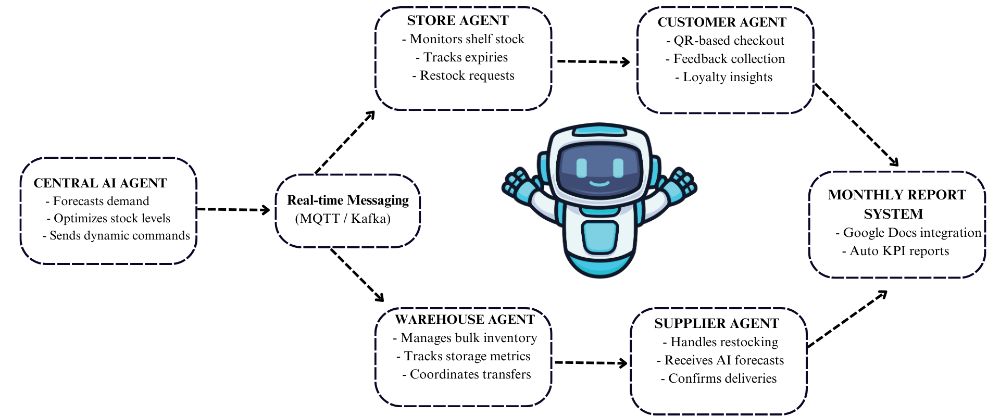

# StockWise 🧠📦  
**AI-Powered Multi-Agent Inventory Management System**  
_Revolutionizing how businesses track, forecast, and optimize inventory_


## 🚀 Overview

**StockWise** offers a fully automated, AI-driven multi-agent system that streamlines retail inventory management. It eliminates manual tracking by enabling real-time monitoring, accurate demand forecasting using the Prophet model, and intelligent restocking decisions. The system connects stores, warehouses, suppliers, and customers through smart agents that communicate seamlessly. It also includes features like expiry alerts, a liquidation marketplace for excess stock, and geo-optimized logistics—ensuring efficient, cost-effective, and scalable inventory operations.

---

## ✅ Key Features

- **Real-Time Inventory Insights**: Monitor stock, expiry dates, and restock alerts.
- **Accurate Forecasting**: Uses Prophet model trained on 3+ years of sales data.
- **Multi-Agent System**: Each agent handles a specific role for modularity and scalability.
- **Geo-Optimized Logistics**: Integrated with Maps API for smart routing.
- **Smart Notifications**: WhatsApp and Telegram bots for real-time alerts and commands.
- **Integrated Marketplace**: Liquidate excess stock efficiently.
- **Monthly Reporting**: Auto-generated reports via Google Docs API.

---

## 🧠 Tech Stack

**Frontend**
- `NextJS`: Frontend dashboards using Chart.js

**Backend & APIs:**
- `Flask`: For easy and fast Backend

**Databases:**
- `Firebase`: Inventory and agent data

**Automation & Integration:**
- `Telegram & WhatsApp API`: Notifications and inventory commands
- `Google Docs API`: Reporting automation
- `Google Maps API`: Route optimization
- `Email`: Email Notification

---
## 📦 File Structure
```plaintext
📦 StockWise 
├── 📁 backend 
│ ├── init.py 
│ ├── .gitignore 
│ ├── buy_prod.py 
│ ├── expired.py 
│ ├── qr_code.py 
│ ├── reminder.py 
│ ├── reminders.json 
│ ├── sales.py 
│ ├── server.py 
│ ├── telegrambuyer.py 
│ ├── twitter-clone-44... 
│ ├── warehouse.py 
│ └── whatsappbuyer.py 
├── 📁 frontend 
│ ├── 📁 .next 
│ ├── 📁 app 
│ ├── 📁 components 
│ ├── 📁 hooks 
│ ├── 📁 lib 
│ ├── 📁 node_modules 
│ ├── 📁 public 
│ ├── 📁 styles 
│ ├── .gitignore 
│ ├── components.json 
│ ├── next-env.d.ts 
│ ├── next.config.mjs 
│ ├── package-lock.json 
│ ├── package.json 
│ ├── pnpm-lock.yaml 
│ ├── postcss.config.mjs 
│ ├── tailwind.config.ts 
│ └── tsconfig.json 
├── 📁 python-backend 
│ ├── 📁 pycache 
│ ├── 📁 data 
│ ├── 📁 models 
│ ├── 📁 modules 
│ ├── app.py 
│ ├── credentials.json 
│ ├── festival_goods.json 
│ ├── googledrive.json 
│ ├── indian_festivals.json 
│ ├── llm.py 
│ ├── model_train.ipynb 
│ ├── requirements.txt 
│ ├── token.pickle 
│ ├── twitter-clone
├── .gitignore 
└── README.md
```
---

## Agents' interaction design 


---